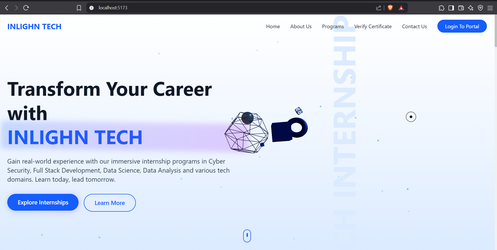
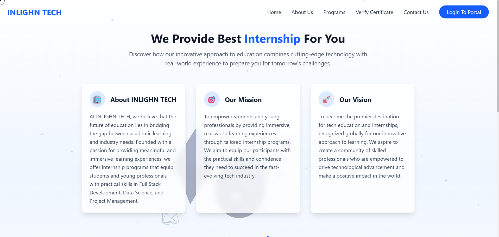
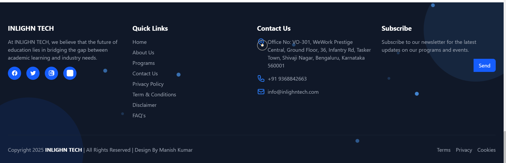

## Inlighn Tech: Modern Website Redesign

A complete, responsive redesign of the official Inlighn Tech website, integrating cutting-edge 3D animations and modern UI/UX practices for an immersive, tech-driven experience.

---

### 📌 Overview

This project aims to elevate the user experience of Inlighn Tech—a company offering immersive internship programs in Cybersecurity, Full Stack Development, Data Science, and Data Analysis—by creating a visually engaging, interactive, and professional website that appeals to tech-savvy students and young professionals.

---

### 🎨 Screenshots

### Home Page
 

### Programs Page


### Testimonials Page


---

### 🎯 Key Features

- **Modern UI/UX Design:** Clean, intuitive interface with a tech-centric look and feel.
- **Immersive 3D Elements:** Smooth 3D animations using React Three Fiber, enhancing interactivity without compromising performance.
- **Information Clarity:** Clear information hierarchy and seamless navigation across all pages (Home, About, Programs, Verify Certificate, Contact).
- **Performance Optimization:** Efficient code and animations ensure fast load times and smooth user experience.
- **Professional Look & Feel:** Maintains a credible, professional appearance fitting for a technology education company.
- **Responsive Design:** Fully responsive layout across all devices—desktop, tablet, and mobile.
- **Brand Consistency:** Color theme and design elements inspired by the existing Inlighn Tech brand.
- **Interactive Animations:** Fluid hover effects, micro-interactions, and scroll-triggered animations using Framer Motion and Tailwind CSS.
- **Accessible & Inclusive:** Adheres to accessibility best practices.

---

### 🛠️ Tech Stack

- **React 19**: Component-based UI.
- **React Router 7**: Client-side routing.
- **Tailwind CSS 4**: Utility-first styling with the Vite plugin (`@tailwindcss/vite`).
- **Framer Motion 12**: Smooth transitions and micro-interactions.
- **React Three Fiber 9 + three 0.177**: 3D graphics and scenes.
- **Lucide React**: Icon set.
- **Vite 6**: Dev server and build.
- **ESLint 9**: Linting with React Hooks and React Refresh plugins.

---

### 📦 Requirements

- Node.js 18+ and npm 9+ (recommended)
- Modern browser with WebGL for 3D features

### 🚀 Getting Started

1. **Clone the repository:**

```bash
git clone https://github.com/Manish-061/finale-iitb.git
cd finale-iitb
```
 
2. **Install dependencies:**

```bash
npm install
```


3. **Start the development server:**

```bash
npm run dev
```


4. **Open your browser:**

`http://localhost:5173`


5. **Build for production:**

```bash
npm run build
```

6. **Preview the production build:**

```bash
npm run preview
```

7. **Run the linter:**

```bash
npm run lint
```

Notes:
- Vite outputs static files to `dist/` suitable for static hosting (Netlify, Vercel, GitHub Pages, etc.).
- Tailwind CSS is configured via the Vite plugin; there is no `tailwind.config.js` in Tailwind v4 by default.


---

### ✨ Design Highlights

- **Hero Section:** Animated 3D background with floating tech shapes and smooth scroll effects.
- **About Section:** Glassmorphism cards, fluid background waves, and staggered entry animations.
- **Programs Section:** Interactive 3D icons, animated grid background, and responsive program cards.
- **Testimonials:** Smooth slide-in/slide-out carousel, floating particles, and hover effects.
- **Footer:** Animated background circles, floating particles, and micro-interactions for social icons.
- **Navbar:** Fluid hover effects, 3D background animation, and mobile-friendly menu.

---

### 📚 References & Inspiration

- **Inlighn Tech Official Website:** For brand consistency and navigation structure.
- **Eduard Bodak, New Engen, Micro:** For modern UI/UX and animation inspiration.
- **Tailwind CSS Animations:** For custom animation effects and responsive design.
- **React Three Fiber:** For 3D graphics and animations.
- **Framer Motion:** For advanced animations and micro-interactions.

---

### 🧭 Project Structure

```text
.
├─ public/
├─ screenshots/
│  ├─ homepage.png
│  ├─ benefits.png
│  └─ footer.png
├─ src/
│  ├─ assets/
│  ├─ components/
│  │  ├─ About.jsx
│  │  ├─ Benefits.jsx
│  │  ├─ CertificationPartners.jsx
│  │  ├─ Contact.jsx
│  │  ├─ CursorProvider.jsx
│  │  ├─ CustomCursor.jsx
│  │  ├─ FloatingTechCube.jsx
│  │  ├─ Footer.jsx
│  │  ├─ Hero.jsx
│  │  ├─ Navbar.jsx
│  │  ├─ Stats.jsx
│  │  └─ Testimonials.jsx
│  ├─ contexts/
│  │  └─ AnimationContext.jsx
│  ├─ hooks/
│  │  ├─ use3DOptimization.js
│  │  ├─ useMousePosition.js
│  │  ├─ useScrollPosition.js
│  │  └─ useSkeletonLoading.js
│  ├─ pages/
│  │  ├─ AboutUs.jsx
│  │  ├─ ContactUs.jsx
│  │  ├─ Home.jsx
│  │  ├─ Programs.jsx
│  │  └─ VerifyCertificate.jsx
│  ├─ styles/
│  │  ├─ cursor.css
│  │  └─ skeleton.css
│  ├─ utils/
│  │  ├─ constants.js
│  │  └─ helpers.js
│  ├─ App.jsx
│  ├─ index.css
│  └─ main.jsx
├─ index.html
├─ package.json
├─ vite.config.js
└─ eslint.config.js
```

Key entry points:
- `src/main.jsx`: React root; wraps `App` in `AnimationProvider`.
- `src/App.jsx`: Router and layout; mounts `Navbar`, `Footer`, and routes.
- `index.html`: HTML template and font preloads.

### 🧭 Routing

- `/`: `Home` (includes `Hero`, `CertificationPartners`, embedded `VerifyCertificate`, `About`, `Stats`, `Benefits`, `Testimonials`, `Contact`).
- `/about`: `AboutUs` with an animated 3D scene.
- `/programs`: `Programs` with category tabs and animated cards; includes 3D background.
- `/verify`: `VerifyCertificate` page for certificate lookup (mock data).
- `/contact`: `ContactUs` page with animated form and company details.

Note: `Navbar` currently uses anchor tags for navigation. For SPA navigation without full reloads, consider swapping to `Link` from `react-router-dom`.

### 🧩 Notable Components

- `Hero.jsx`: Combined 3D scene with animated dodecahedron and floating tech elements using React Three Fiber; CTA buttons use `Link`.
- `CertificationPartners.jsx`: Simulates data loading, shows skeletons, then renders partner logos; uses `react-loading-skeleton`.
- `VerifyCertificate.jsx`: Fully interactive mock verification flow with success/error UX; uses Lucide icons.
- `Testimonials.jsx`: Carousel with animated transitions via `AnimatePresence`.
- `Navbar.jsx`: Scroll-aware header, mobile slide-in menu.
- `CursorProvider.jsx` + `CustomCursor.jsx`: Replaces system cursor with animated cursor; respects `prefers-reduced-motion` and touch devices.
- `AnimationContext.jsx`: Centralized control for animation enablement; respects reduced motion.

### 🧠 Hooks & Utilities

- `use3DOptimization`: Enables/disables 3D rendering based on WebGL support and device capability.
- `useMousePosition`: Throttled mouse tracking using `requestAnimationFrame`.
- `useScrollPosition`: Boolean for scroll threshold.
- `useSkeletonLoading`: Timed loading state to drive skeletons.

### 🎨 Styling

- Tailwind CSS v4 via `@tailwindcss/vite` plugin. Global imports live in `src/index.css`:
  - `@import "tailwindcss";`
  - Custom styles: `styles/cursor.css`, `styles/skeleton.css`.
- Smooth transitions enabled globally; custom scrollbar styles.

### ⚙️ Tooling & Scripts

- `npm run dev`: Start Vite dev server.
- `npm run build`: Build production assets to `dist/`.
- `npm run preview`: Preview production build locally.
- `npm run lint`: Run ESLint (configured in `eslint.config.js`).

ESLint highlights:
- Extends recommended JS and React Hooks rules.
- Warns on exporting non-component values with React Refresh rule.
- Ignores `dist/`.

### 🔒 Accessibility & Performance

- Respects `prefers-reduced-motion` to disable animations and custom cursor effects.
- 3D scenes optimized via conditional rendering (`use3DOptimization`).
- Skeleton loading for perceived performance.
- Keyboard-focus friendly components and large tap targets.

### 🧪 Data & API

- No backend in this repository. The certificate verification uses mock data inside `src/pages/VerifyCertificate.jsx`.
- Replace mock certificate map with a real API call when integrating backend services.

### 🚀 Deployment

- Build artifacts are static: deploy the `dist/` directory to any static host.
- Typical hosts: Netlify, Vercel, Cloudflare Pages, GitHub Pages.
- Ensure routes are served with SPA fallback to `index.html` (configure 404/redirects accordingly).

### 🧰 Troubleshooting

- 3D not visible: Ensure your browser supports WebGL and that device is not considered low-end by `use3DOptimization`.
- Dev server port in use: Change Vite port via `vite --port 5174` or `vite.config.js`.
- Navigation reloads in production: Replace `<a href>` in `Navbar.jsx` with `Link` components to avoid full page refreshes.
- Tailwind not applying: Make sure you are editing files inside `src/` and that `index.css` imports `tailwindcss`.

- **Content:** Dummy data is used for demonstration. Actual content can be easily replaced.
- **Animations:** All animations are optimized for performance and do not interfere with usability.
- **Accessibility:** The site follows best practices for accessibility and keyboard navigation.

---

### 🙌 Credits

- **Design & Development:** Manish Kumar
- **Icons:** Lucide Icons
- **Animation Libraries:** Framer Motion, React Three Fiber
- **Inspired by:** Inlighn Tech, Eduard Bodak, New Engen, Micro

---

### 📄 License

MIT License

---

### 🌟 Thank You!

*Last updated: August 2025*
